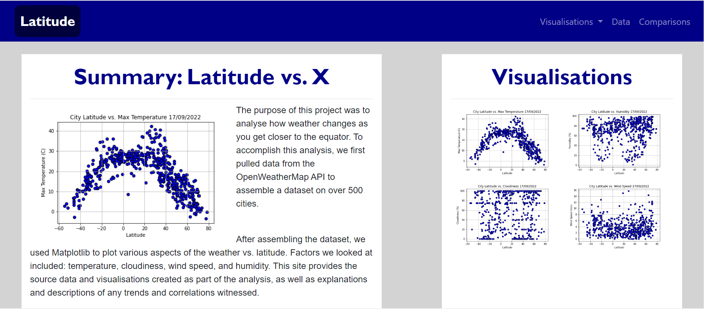

# Weather Analysis Website Design
  
The purpose of this project was to analyse how weather changes as you get closer to the equator. To accomplish this analysis, we first pulled data from the OpenWeatherMap API to assemble a dataset on over 500 cities.  
  
After assembling the dataset, we used Matplotlib to plot various aspects of the weather vs. latitude. Factors we looked at included: temperature, cloudiness, wind speed, and humidity. This site provides the source data and visualisations created as part of the analysis, as well as explanations and descriptions of any trends and correlations witnessed.  
  

    

  
To view the website Home page: [Click here](https://frankms3.github.io/Weather-Web-Design/)  
  
-------------------------------------------------------------  
  
# Website Contents:  
The Navbar located at the top of each page allows for easy navigation between pages within the website.  
  
[Home](https://frankms3.github.io/Weather-Web-Design/)  
- Acts as a landing page, providing a summary of the project, as well as preview images that link to each of the individual visualisation pages.  

[Data](https://frankms3.github.io/Weather-Web-Design/data.html)  
- Displays a table containing the data used for this project.  

[Comparisons](https://frankms3.github.io/Weather-Web-Design/comparisons.html)  
- Contains all the visualisations on the same page for easy comaparison, clicking any of these will take you to it's individual visualisation page.  

The Visualisation pages:  
- Each of these contains the selected visualisation image with a paragraph describing it and it's significance.  

[Max Temperature](https://frankms3.github.io/Weather-Web-Design/visualisations/temperature.html)  
[Humidity](https://frankms3.github.io/Weather-Web-Design/visualisations/humidity.html)  
[Cloudiness](https://frankms3.github.io/Weather-Web-Design/visualisations/cloudiness.html)  
[Wind Speed](https://frankms3.github.io/Weather-Web-Design/visualisations/wind.html)  
  
--------------------------------------------------------------------  
  
All pages are responsive to window size changes, as well as screens of varying size.  
